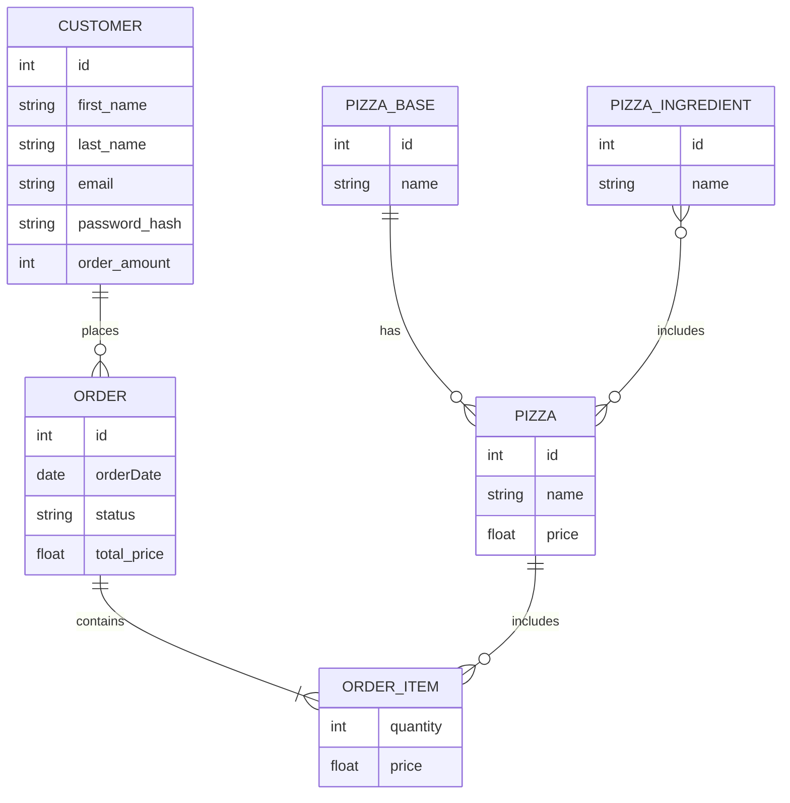

# PIZZA API

Cette solution a pour objectif de mettre en place une API REST monolitique pour la gestion de commandes de pizza en ligne.

On utilise docker pour le déploiement de l'application ASP.NET dans un container. On doit également disposer d'un container supplémentaire pour héberger une base de données MySQL servant au test avec le model relationnel suivant

Les spécifications de l'API ne sont pas compètes.